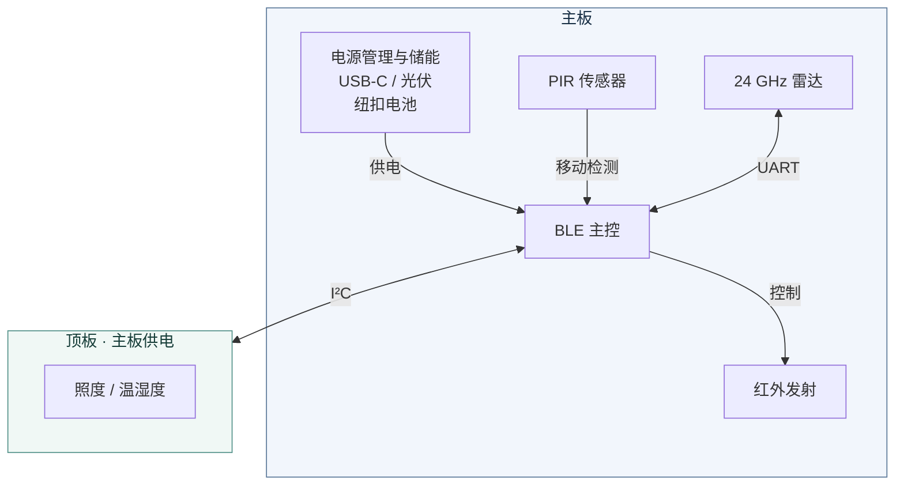

# 硬件系统框图

```mermaid
flowchart TB
    subgraph MAIN["主板"]
        PWR["电源管理与储能<br/>USB-C / 光伏<br/>纽扣电池"]
        PIR["PIR 传感器"]
        RADAR["24 GHz 雷达"]
        MCU["BLE 主控"]
        IR["红外发射"]

        PWR -->|供电| MCU
        PIR -->|移动检测| MCU
        RADAR <-->|UART| MCU
        MCU -->|控制| IR
    end

    subgraph TOP["顶板 · 主板供电"]
        ENV["照度 / 温湿度"]
    end

    MCU <-->|I²C| TOP

    style MAIN fill:#f2f6fc,stroke:#5b7899,color:#172e44
    style TOP fill:#f0f8f5,stroke:#54928a,color:#163d38
```
